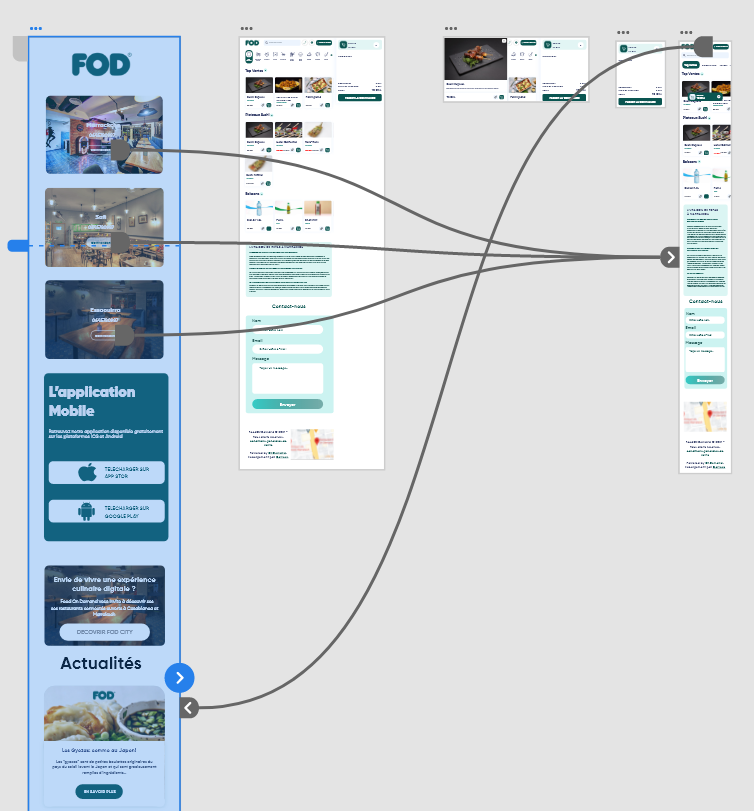
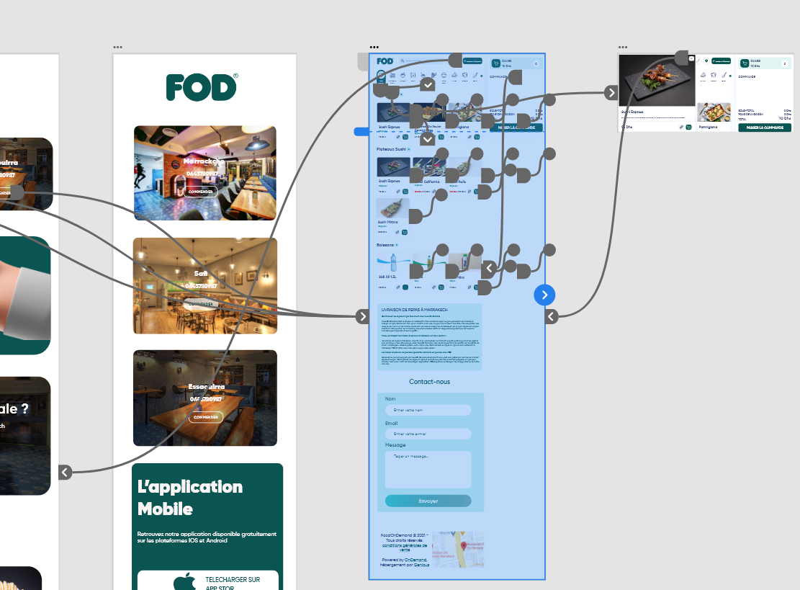
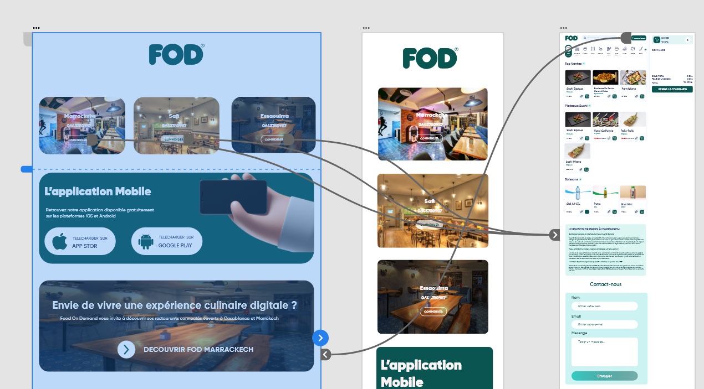

# Table of contents

- [Brief1-FOD-Clone](#brief1-FOD-Clone)
- [Tools](#tools)
- [Tasks](#tasks)
- [Schema](#schema)

# Brief1-FOD-Clone

- Prototype: [Live Demo](https://xd.adobe.com/view/9e88fd76-37f4-4e36-8c03-c376b4362c4e-cbdb/?fullscreen)
- FOD: [https://www.fod.ma/](https://www.fod.ma/)

## Tools

- Adobe XD
- Figma

## Tasks

### Zonning

- ELHADRI Nadia: Section 1,Section 2, Section 5 (Home page - mobile & desktop) 
- GASSAI Hamza: Section 3, Section 4,Section 6 (Home page - mobile & desktop)

### Wireframing

- ELHADRI Nadia: Mobile
- GASSAI Hamza: Desktop

### Prototyping

- ELHADRI Nadia: Home page (Mobile & Desktop)
- GASSAI Hamza: Delivery page (Mobile & Desktop)

### Chart

- GASSAI Hamza & ELHADRI Nadia

## Schema

